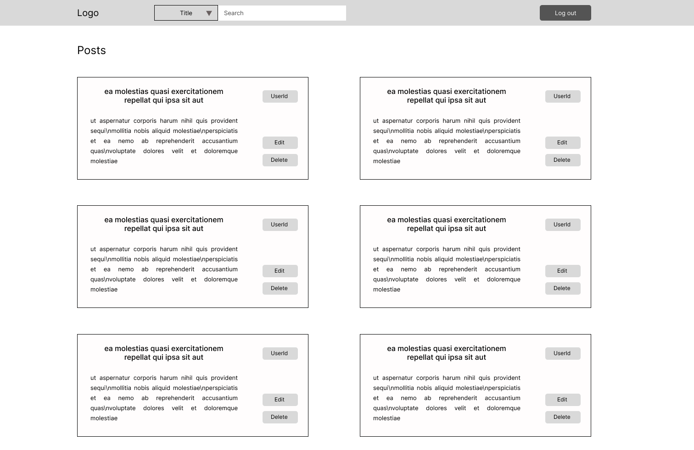

# Prueba tecnica Cleverpy - Posts App - Alejandro Villegas

Aplicacion de ReactJs desarrollada en Vite con TypeScript, Scss, Redux toolkit, Cypress 


## Live site 
https://posts-app-pt.netlify.app/


## Diseño  



Mockup realizado en Figma, la version final tiene algunos cambios importantes en la forma de mostrar los posts porque en el desarrollo considere que mostrar los posts de otra forma era mas adecuado.

- Se creo un archivo scss en la carpeta utils para almacenar las variables de los colores usados en la app. 
- Se uso la libreria framer-motion para crear un efecto de aparicion en los posts a medida que van apareciendo en la pantalla. 
- Se uso la libreria react-icons para iconos. 


## Funcionalidad

- Desplegar todos los posts obtenidos de la API de jsonplaceholder.typicode.com
- Eliminar posts a nivel de cliente
- Edicion de posts a nivel de cliente
- Filtrado de posts por title, body y usuario sin que esto conlleve que se pierdad los posts originales de la llamada a la API. 
- Manejo de rutas con react-router para manejar el cambio de vista entre el PostList y el LoginView


## Estado 

El estado fue creado con Redux y Redux toolkit, la eleccion de usar Redux para el manejo de estado fue porque 
en la prueba tecnica decia que usarlo se valoraria positivamente, mas alla de eso haberlo usado permitio agregar
 funcionalidades extras sin mayor complejidad, cosa que hubiese sido un poco mas complicada
usando solo useState, ya que hubiese caido en un prop drilling , usar useContext en combinacion con un useReducer tambien hubiese sido una opcion muy valida. 


## Conexion con la API 

Para conectar la API con el store de la aplicacion desarrolle un useFetch, pense en reutilizarlo para hacer las busquedas por title o body a nivel de API, 
pero despues de ver la documentacion de la API me di cuenta que no permite este tipo de busquedas, asi que solo use una vez este custom hook con el service
getAllPosts, pero la creacion de este hook facilitaria posibles ampliaciones de la app . 

Despues de traerme los datos de la API con el hook se los pase a el estado del redux dentro de un useEffect con la funcion dispatcher y actions de Redux


```js
 const { data, isLoading } = useFetch(getAllPosts);

  const dispatch = useDispatch();

  useEffect(() => {
    if (data) {
      dispatch(fetchInitialPosts(data));
    }
  }, [dispatch, data]);
```
## Tests 

Para los tests E2E use Cypress. Los tests que cree fueron los siguientes: 

- Probar que la pagina renderiza .
- El usuario puede editar y guardar su edicion de un post. 
- El usuario puede buscar entre los posts por title o por body. 
- El usuario puede borrar una nota. 
- El usuario puede filtrar por userId .
- El usuario puede desplazarse entre la vista de Posts y de Login  


